# MERN Application Deployment

## Overview

This repository contains scripts and configuration files for deploying a MERN (MongoDB, Express.js, React.js, Node.js) application on AWS using Terraform for infrastructure provisioning and Ansible for configuration management and deployment automation.

## Infrastructure Setup

### Terraform

- AWS Setup and Terraform Initialization:
    - Configure AWS CLI and authenticate with your AWS account.
    - Initialize a new Terraform project targeting AWS.
- VPC and Network Configuration:
    - Create an AWS VPC with two subnets: one public and one private.
    - Set up an Internet Gateway and a NAT Gateway.
    - Configure route tables for both subnets.

- EC2 Instance Provisioning:
    - Launch two EC2 instances: one in the public subnet (for the web server) and another in the private subnet (for the database).
    - Ensure both instances are accessible via SSH (public instance only accessible from your IP).
- Security Groups and IAM Roles:
    - Create necessary security groups for web and database servers.
    - Set up IAM roles for EC2 instances with required permissions.
- Resource Output:
    - Output the public IP of the web server EC2 instance.

- **AWS Setup**: Ensure your AWS CLI is configured and authenticated with your AWS account.

```Terraform
terraform {
  required_providers {
    aws = {
      source  = "hashicorp/aws"
      version = "~> 4.16"
    }
    local = {
      source  = "hashicorp/local"
      version = "2.0.0"  # You can adjust the version if needed
    }
    tls = {
      source  = "hashicorp/tls"
      version = "3.0.0"  # You can adjust the version if needed
    }
  }

  required_version = ">= 1.2.0"
}

provider "aws" {
  region  = "us-west-2"
}

# Create VPC
resource "aws_vpc" "mern_app_vpc" {
  cidr_block = "10.0.0.0/16"
  tags = {
    Name = "mern_app"
  }
}

# Create public subnet
resource "aws_subnet" "public_subnet" {
  vpc_id            = aws_vpc.mern_app_vpc.id
  cidr_block        = "10.0.1.0/24"
  availability_zone = "us-west-2a"
  # map_public_ip_on_launch = true
  tags = {
    Name = "public_subnet"
  }
}

# Create private subnet
resource "aws_subnet" "private_subnet" {
  vpc_id            = aws_vpc.mern_app_vpc.id
  cidr_block        = "10.0.2.0/24"
  availability_zone = "us-west-2b"
  tags = {
    Name = "private_subnet"
  }
}

# Create internet gateway
resource "aws_internet_gateway" "mern_app_igw" {
  vpc_id = aws_vpc.mern_app_vpc.id

  tags = {
    Name = "mern_app_ig"
  }
}

# Create EIP for NAT gateway
resource "aws_eip" "nat" {
  tags = {
    Name = "mern_app_eip"
  }
  vpc = true
}

# Create NAT gateway
resource "aws_nat_gateway" "nat" {
  depends_on = [ aws_eip.nat ]
  allocation_id = aws_eip.nat.id
  subnet_id     = aws_subnet.public_subnet.id
  tags = {
    Name = "mern_app_nat_gateway"
  }
}

# Create route table for public subnet
resource "aws_route_table" "public_route_table" {
  vpc_id = aws_vpc.mern_app_vpc.id

  route {
    cidr_block = "0.0.0.0/0"
    gateway_id = aws_internet_gateway.mern_app_igw.id
  }

  tags = {
    Name = "public_route_table"
  }
}

# Create route table for private subnet
resource "aws_route_table" "private_route_table" {
  vpc_id = aws_vpc.mern_app_vpc.id
  depends_on = [ aws_nat_gateway.nat ]
  route {
    cidr_block     = "0.0.0.0/0"
    nat_gateway_id = aws_nat_gateway.nat.id
  }

  tags = {
    Name = "private_route_table"
  }
}

# Associate public subnet with the public route table
resource "aws_route_table_association" "public_route_table_association" {
  depends_on = [ aws_subnet.public_subnet, aws_route_table.public_route_table ]
  subnet_id      = aws_subnet.public_subnet.id
  route_table_id = aws_route_table.public_route_table.id
}

# Associate private subnet with private route table
resource "aws_route_table_association" "private_subnet_assoc" {
  depends_on = [ aws_subnet.private_subnet, aws_route_table.private_route_table ]
  subnet_id      = aws_subnet.private_subnet.id
  route_table_id = aws_route_table.private_route_table.id
}

# Create security group for instances in the public subnet
resource "aws_security_group" "public_sg" {
  name        = "public_sg"
  description = "Allow inbound traffic to instances in the public subnet"
  vpc_id      = aws_vpc.mern_app_vpc.id
  depends_on = [ aws_vpc.mern_app_vpc ]
  # Allow SSH
  ingress {
    from_port   = 22
    to_port     = 22
    protocol    = "tcp"
    cidr_blocks = ["0.0.0.0/0"]
  }

  # Allow HTTP
  ingress {
    from_port   = 80
    to_port     = 80
    protocol    = "tcp"
    cidr_blocks = ["0.0.0.0/0"]
  }

  # Allow HTTPS
  ingress {
    from_port   = 443
    to_port     = 443
    protocol    = "tcp"
    cidr_blocks = ["0.0.0.0/0"]
  }

  # Allow 3001 for backend
  ingress {
    from_port   = 3001
    to_port     = 3001
    protocol    = "tcp"
    cidr_blocks = ["0.0.0.0/0"]
  }

  # Allow 3000 for frontend
  ingress {
    from_port   = 3000
    to_port     = 3000
    protocol    = "tcp"
    cidr_blocks = ["0.0.0.0/0"]
  }

  # Allow all outbound traffic
  egress {
    from_port   = 0
    to_port     = 0
    protocol    = "-1"
    cidr_blocks = ["0.0.0.0/0"]
    self = false
    security_groups = []
    ipv6_cidr_blocks = []
    prefix_list_ids = []
    description = ""
  }
}

# Define security groups private
resource "aws_security_group" "private_sg" {
  name        = "private_sg"
  description = "Security group for database server"
  vpc_id      = aws_vpc.mern_app_vpc.id

  # Allow SSH from your IP only
  ingress {
    from_port   = 22
    to_port     = 22
    protocol    = "tcp"
    cidr_blocks = ["0.0.0.0/0"]
  }

  # Allow MongoDB port
  ingress {
    from_port   = 27017
    to_port     = 27017
    protocol    = "tcp"
    cidr_blocks = ["0.0.0.0/0"]
  }

  # Allow HTTP
  ingress {
    from_port   = 80
    to_port     = 80
    protocol    = "tcp"
    cidr_blocks = ["0.0.0.0/0"]
  }

  # Allow all outbound traffic
  egress {
    from_port   = 0
    to_port     = 0
    protocol    = "-1"
    cidr_blocks = ["0.0.0.0/0"]
  }
}

# Create EC2 instances for Web Server
resource "aws_instance" "web_server" {
  count                  = var.web_server_count
  ami                    = "ami-0cf2b4e024cdb6960" # Specify your desired AMI
  instance_type          = "t3.micro"     # Adjust instance type as needed
  subnet_id              = aws_subnet.public_subnet.id
  vpc_security_group_ids = [aws_security_group.public_sg.id]
  associate_public_ip_address = true
  key_name               = var.aws_key_pair_name
  user_data = <<-EOF
    #!/bin/bash
    sudo apt-get update -y
    sudo apt-get install -y ca-certificates curl gnupg
    sudo mkdir -p /etc/apt/keyrings
    curl -fsSL https://deb.nodesource.com/gpgkey/nodesource-repo.gpg.key | sudo gpg --dearmor -o /etc/apt/keyrings/nodesource.gpg || { echo "Failed to import GPG key"; exit 1; }
    NODE_MAJOR=18
    echo "deb [signed-by=/etc/apt/keyrings/nodesource.gpg] https://deb.nodesource.com/node_$NODE_MAJOR.x nodistro main" | sudo tee /etc/apt/sources.list.d/nodesource.list
    sudo apt-get update -y
    sudo apt-get install -y nodejs
  EOF
  
  tags = {
    Name = "WebServer_${count.index + 1}"
    Environment = "Production"
    Owner       = "Surender Gupta"
    Project     = "Travel Memory"
  }
}

# Create EC2 instances for Database Server
resource "aws_instance" "db_server" {
  count                  = var.db_server_count
  ami                    = "ami-0cf2b4e024cdb6960" # Specify your desired AMI
  instance_type          = "t3.micro"     # Adjust instance type as needed
  subnet_id              = aws_subnet.private_subnet.id
  security_groups        = [aws_security_group.private_sg.id]
  associate_public_ip_address = false
  key_name               = var.aws_key_pair_name
  
  user_data = <<-EOF
    #!/bin/bash
    sudo apt-get update -y
    sudo apt-get install -y docker.io
    sudo usermod -aG docker $USER
    sudo chmod 666 /var/run/docker.sock
  EOF

  tags = {
    Name = "DatabaseServer_${count.index + 1}"
  }
}

data "template_file" "ansible_inventory" {
  template = <<-EOT
[web_server]
%{ for i in range(var.web_server_count) ~}
tm_server_${i+1} ansible_host=${element(aws_instance.web_server[*].public_ip, i)}
%{ endfor ~}

[db_server]
%{ for i in range(var.db_server_count) ~}
db_server_${i+1} ansible_host=${element(aws_instance.db_server[*].private_ip, i)}
%{ endfor ~}

[all:vars]
ansible_user=ubuntu
ansible_ssh_private_key_file=~/.ssh/ansible_key
EOT
}

resource "local_file" "ansible_inventory_file" {
  filename = "../ansible/inventory.ini"
  content  = data.template_file.ansible_inventory.rendered
}


```

- **Initialization**: Initialize Terraform in the project directory.
```bash
  source run.sh | . run.sh
  terraform init
```

- **Validation**: Validate the Terraform configuration.
```bash
  terraform validate
```

- **Plan**: Review the planned infrastructure changes.
```bash
  terraform plan
```

- **Apply**: Apply the Terraform configuration to provision the infrastructure.
```bash
  terraform apply
```

- **Destroy**: Destroy the provisioned infrastructure when no longer needed.
```bash
  terraform destroy
```


## Configuration and Deployment


### Ansible

- **Installation**: Ensure Ansible is installed on your local machine.
```bash
  sudo apt update
  sudo apt install ansible
```

- **Inventory**: get Ansible inventory file (inventory.ini) with the IP addresses of your EC2 instances from terrafrom apply cmd executed.

- **ansible.cfg**: Create an Ansible config file (ansible.cfg)
```ansible.cfg
[defaults]
inventory=./inventory.ini
private_key=~/.ssh/ansible_key
remote_user=ubuntu
ask_pass=false
callback_whitelist=log

[privilege_escalation]
become=True
become_method=sudo
become_user=root
become_ask_pass=false
```

- **Execute**: Run these command for avoid and save private key in cfg

```bash
cat ~/.ssh/ansible_key >> ~/.ssh/authorized_keys
eval $(ssh-agent)
ssh-add ~/.ssh/ansible_key

```

- **Execution**: Run Ansible playbooks to configure and deploy the application.
```bash
  ansible web_server -m ping
  ansible web_server -a "node -v"
  ansible web_server -a "npm -v"
  ansible-playbook copy_key.yml
  ansible web_server -a "ls -ltr"
  ansible-playbook nginx-playbook.yml
  curl http://35.89.147.91
  ansible-playbook web_server_setup.yml
  ansible web_server -a "ls"
```
- **DB_SERVER**: Setup Database server
```bash
  chmod 400 terraform_tm_key.pem
  ssh -i terraform_tm_key.pem ubuntu@35.89.147.91
  ubuntu@ip-10.0.1.19:~/ ssh -i terraform_tm_key.pem ubuntu@10.0.2.206
  docker ps
  docker pull mongo
  docker run -dp 27017:27017 -e MONGO_INITDB_ROOT_USERNAME=root -e MONGO_INITDB_ROOT_PASSWORD=root -v /data/db --name mongodb mongo:latest
  docker exec -it mongodb /bin/bash
  mongosh -u root -p root
  use travelmemory
  db.createUser({
      user: "root",
      pwd: "secret1234",
      roles: [{ role: "readWrite", db: "travelmemory" }]
  });
```
- **DEPLOY_SERVER**: Deploy Frontend and backend server
```bash
  ansible-playbook app_deployment.yml
  ansible-playbook configure_nginx.yml
```

### Screenshots
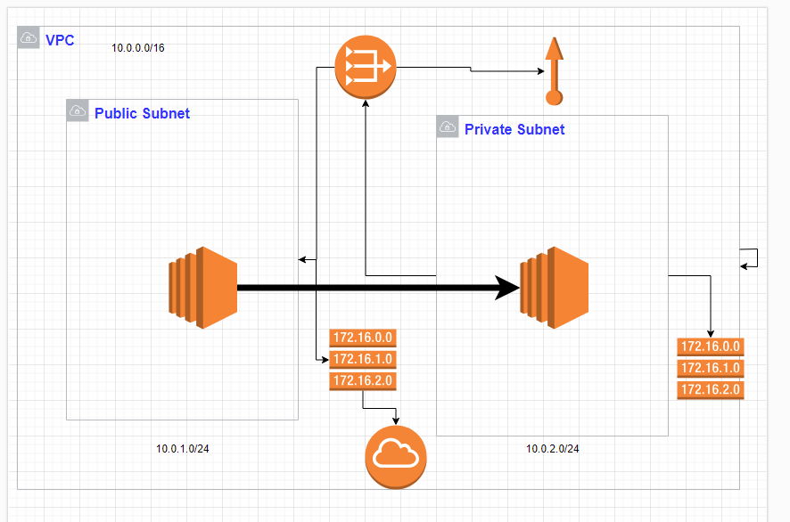

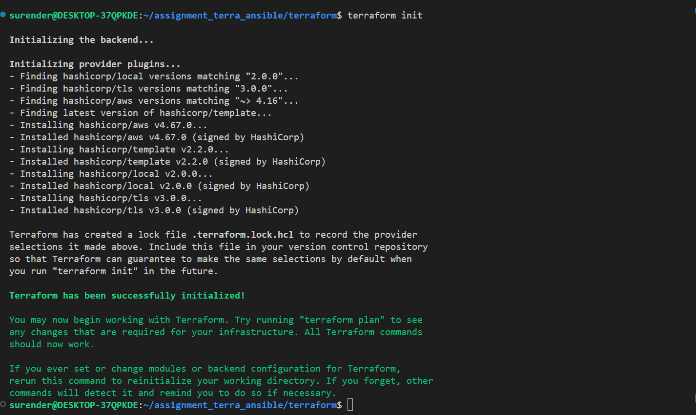

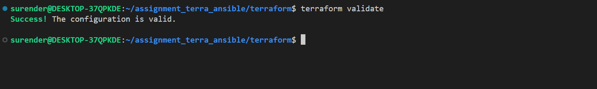

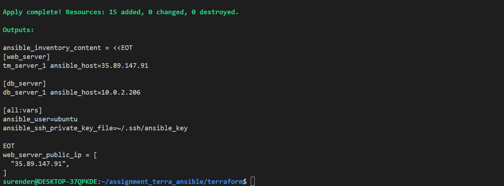

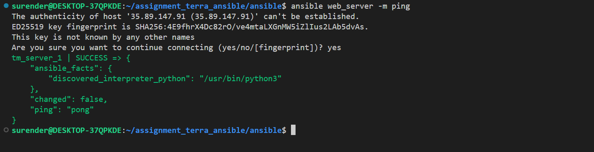

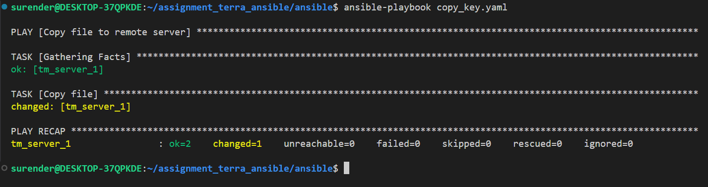

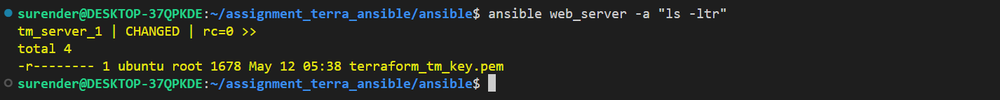

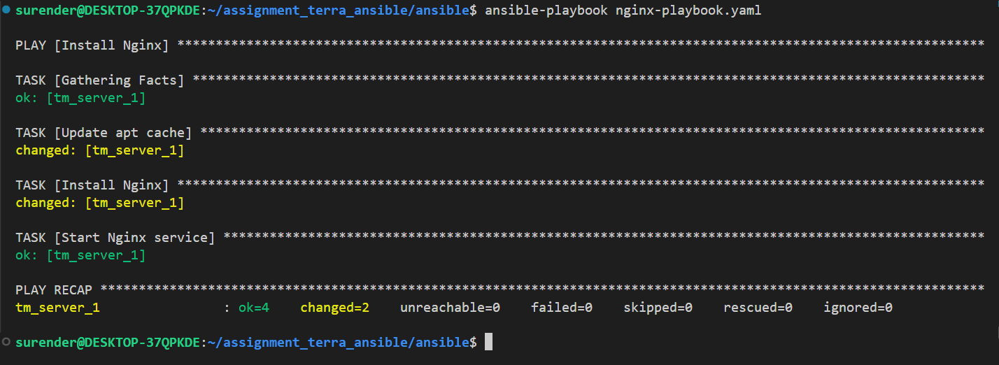

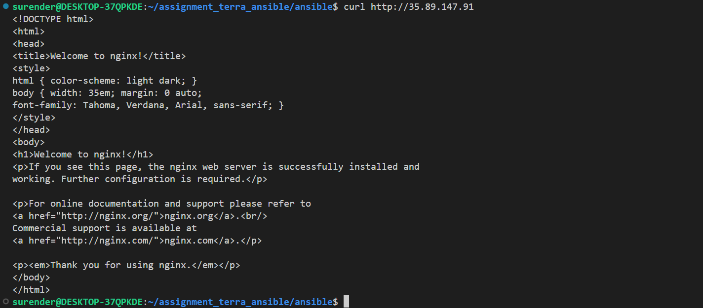

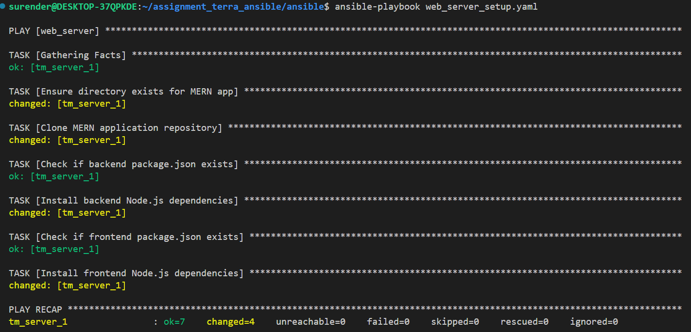

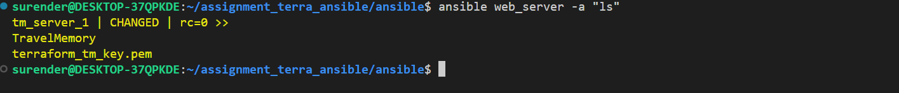

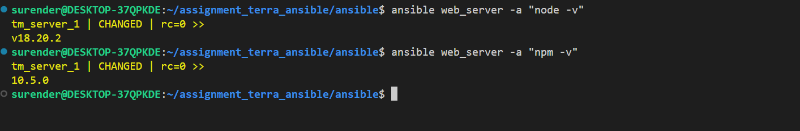


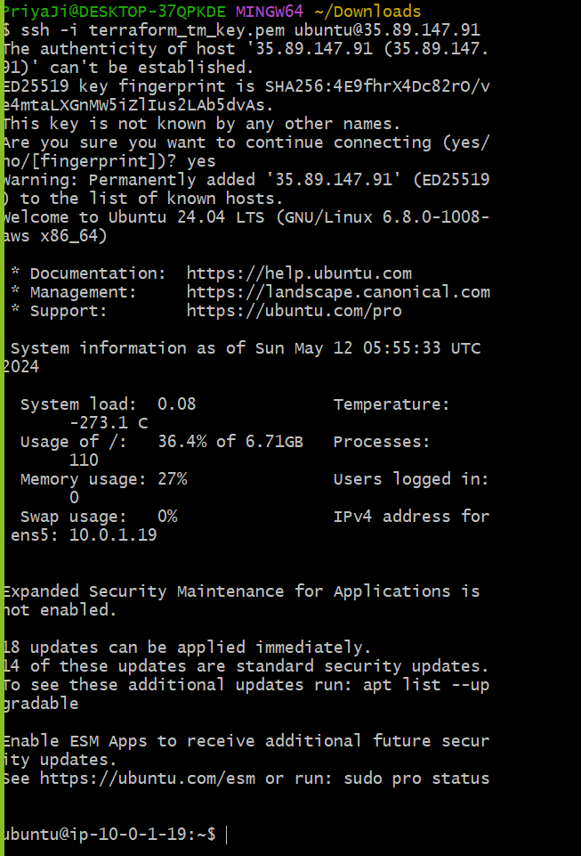


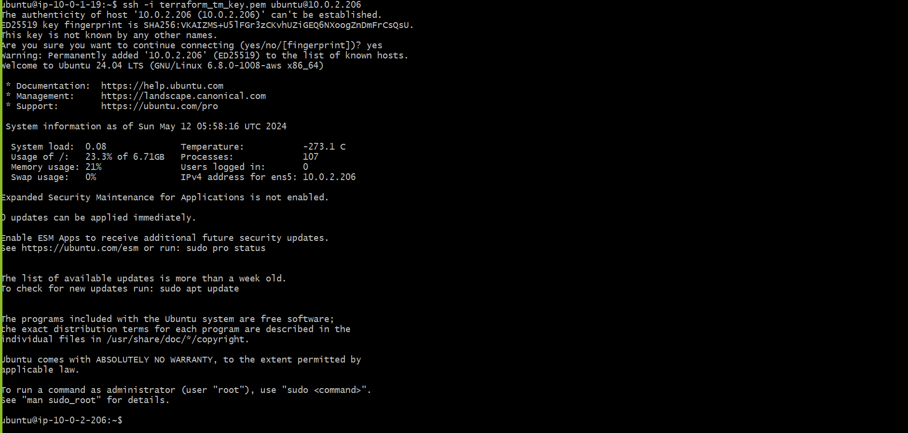

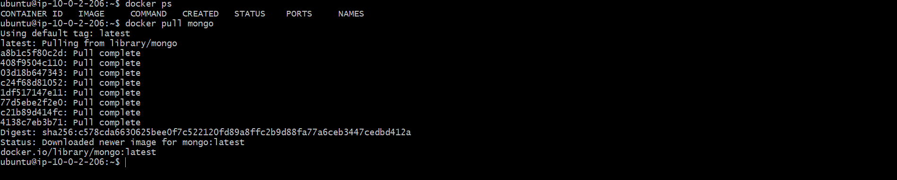


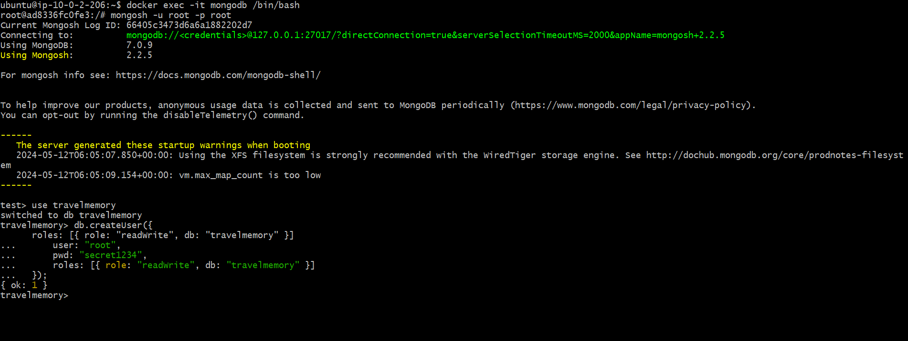

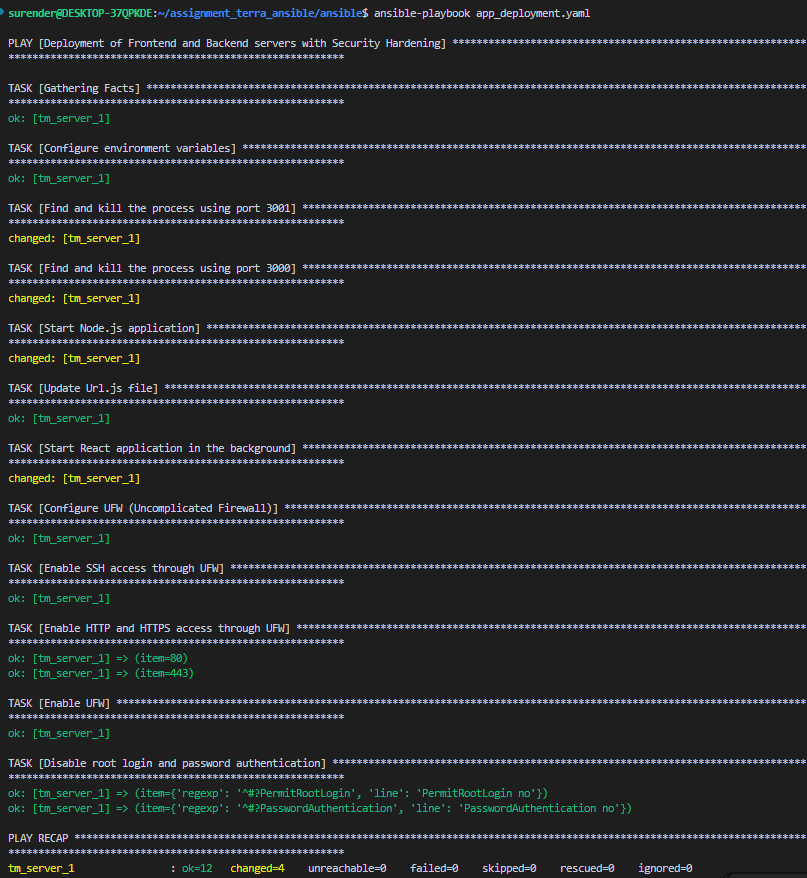

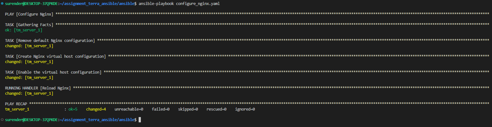

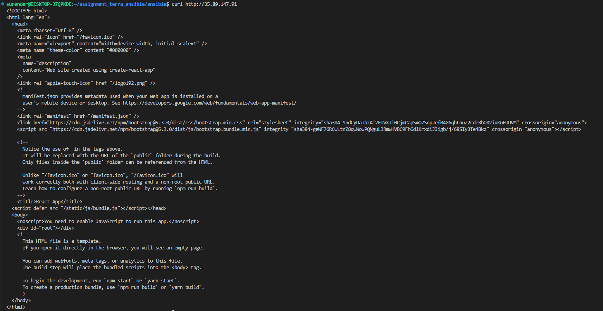


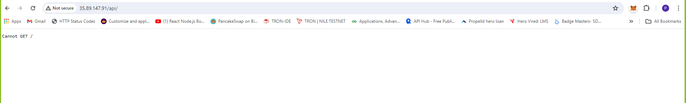

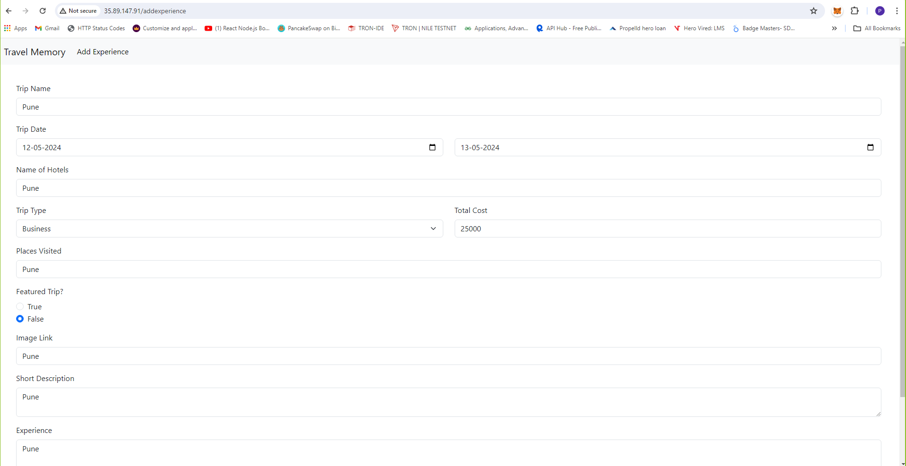

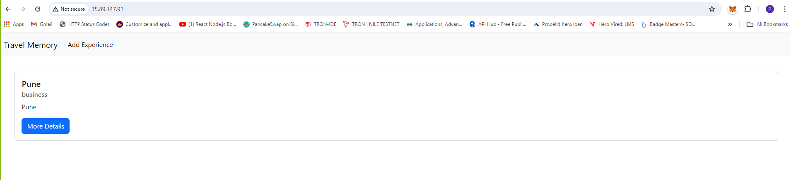

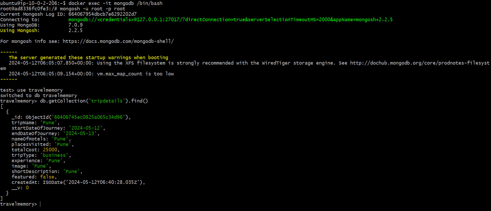

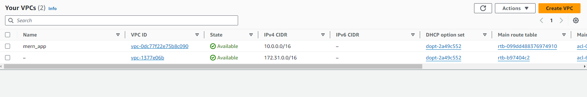

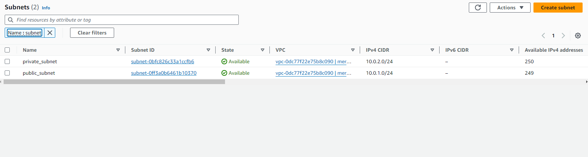

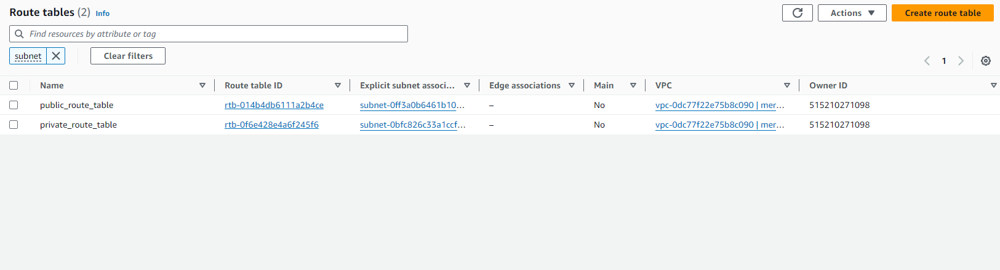

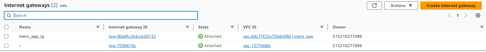

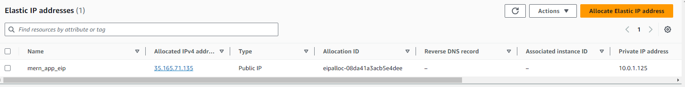

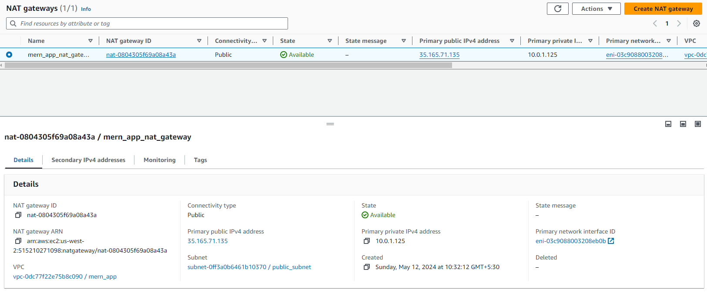

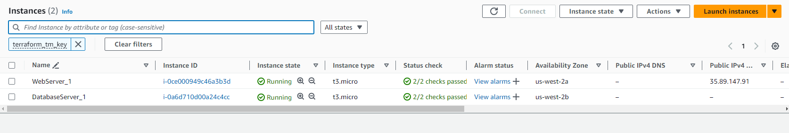

### Directory Structure
- **terraform/**: Contains Terraform configuration files for infrastructure provisioning.
- **ansible/**: Contains Ansible playbooks and template files for configuration management.
- **README.md**: Documentation file providing an overview of the project and instructions for deployment.

### Usage

- Provision infrastructure using Terraform.
- Create an Ansible inventory file with EC2 instance IP addresses.
- Execute Ansible playbooks to configure and deploy the application.
