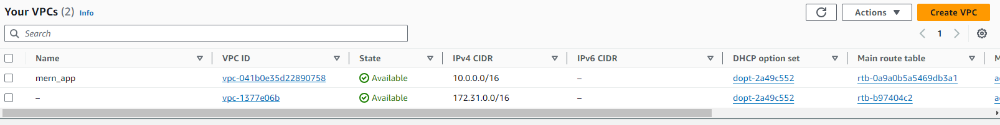
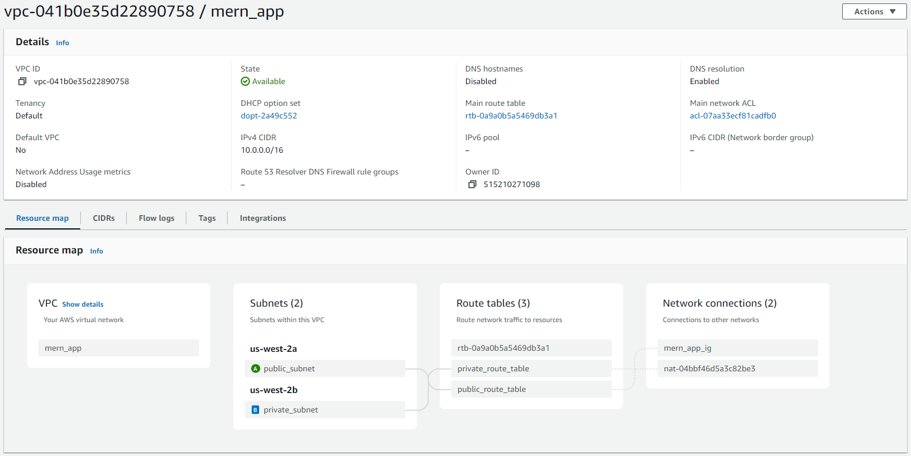
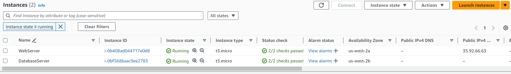
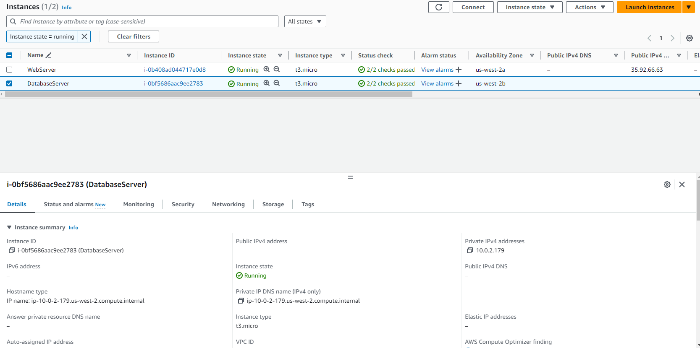
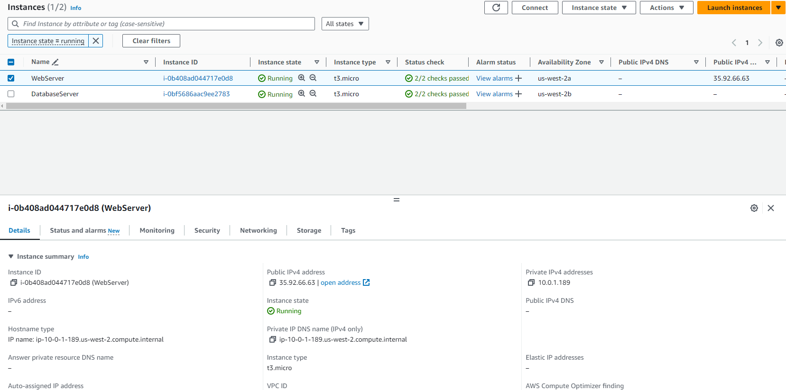
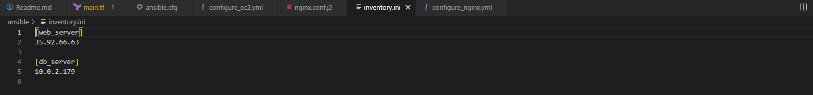

# MERN Application Deployment

## Overview

This repository contains scripts and configuration files for deploying a MERN (MongoDB, Express.js, React.js, Node.js) application on AWS using Terraform for infrastructure provisioning and Ansible for configuration management and deployment automation.

## Infrastructure Setup

### Terraform

- AWS Setup and Terraform Initialization:
    - Configure AWS CLI and authenticate with your AWS account.
    - Initialize a new Terraform project targeting AWS.
- VPC and Network Configuration:
    - Create an AWS VPC with two subnets: one public and one private.
    - Set up an Internet Gateway and a NAT Gateway.
    - Configure route tables for both subnets.

- EC2 Instance Provisioning:
    - Launch two EC2 instances: one in the public subnet (for the web server) and another in the private subnet (for the database).
    - Ensure both instances are accessible via SSH (public instance only accessible from your IP).
- Security Groups and IAM Roles:
    - Create necessary security groups for web and database servers.
    - Set up IAM roles for EC2 instances with required permissions.
- Resource Output:
    - Output the public IP of the web server EC2 instance.

- **AWS Setup**: Ensure your AWS CLI is configured and authenticated with your AWS account.

```Terraform
terraform {
  required_providers {
    aws = {
      source  = "hashicorp/aws"
      version = "~> 4.16"
    }
    local = {
      source  = "hashicorp/local"
      version = "2.0.0"  # You can adjust the version if needed
    }
    tls = {
      source  = "hashicorp/tls"
      version = "3.0.0"  # You can adjust the version if needed
    }
  }

  required_version = ">= 1.2.0"
}

provider "aws" {
  region  = "us-west-2"
}

# Create VPC
resource "aws_vpc" "mern_app" {
  cidr_block = "10.0.0.0/16"
  tags = {
    Name = "mern_app"
  }
}

# Create public subnet
resource "aws_subnet" "public_subnet" {
  vpc_id            = aws_vpc.mern_app.id
  cidr_block        = "10.0.1.0/24"
  availability_zone = "us-west-2a"
  map_public_ip_on_launch = true
  tags = {
    Name = "public_subnet"
  }
}

# Create private subnet
resource "aws_subnet" "private_subnet" {
  vpc_id            = aws_vpc.mern_app.id
  cidr_block        = "10.0.2.0/24"
  availability_zone = "us-west-2b"
  tags = {
    Name = "private_subnet"
  }
}

# Create EIP for NAT gateway
resource "aws_eip" "nat" {
  #instance = aws_nat_gateway.nat.id
  vpc = true
}

# Create NAT gateway
resource "aws_nat_gateway" "nat" {
  allocation_id = aws_eip.nat.id
  subnet_id     = aws_subnet.private_subnet.id
}

# Create internet gateway
resource "aws_internet_gateway" "igw" {
  vpc_id = aws_vpc.mern_app.id

  tags = {
    Name = "mern_app_ig"
  }
}

# Create route table for public subnet
resource "aws_route_table" "public_route_table" {
  vpc_id = aws_vpc.mern_app.id

  route {
    cidr_block = "0.0.0.0/0"
    gateway_id = aws_internet_gateway.igw.id
  }

  tags = {
    Name = "public_route_table"
  }
}

# Associate public subnet with the public route table
resource "aws_route_table_association" "public_route_table_association" {
  subnet_id      = aws_subnet.public_subnet.id
  route_table_id = aws_route_table.public_route_table.id
}

# Create security group for instances in the public subnet
resource "aws_security_group" "public_sg" {
  name        = "public_sg"
  description = "Allow inbound traffic to instances in the public subnet"
  vpc_id      = aws_vpc.mern_app.id

  # Allow SSH
  ingress {
    from_port   = 22
    to_port     = 22
    protocol    = "tcp"
    cidr_blocks = ["0.0.0.0/0"]
  }

  # Allow HTTP
  ingress {
    from_port   = 80
    to_port     = 80
    protocol    = "tcp"
    cidr_blocks = ["0.0.0.0/0"]
  }

  # Allow HTTPS
  ingress {
    from_port   = 443
    to_port     = 443
    protocol    = "tcp"
    cidr_blocks = ["0.0.0.0/0"]
  }

  # Allow all outbound traffic
  egress {
    from_port   = 0
    to_port     = 0
    protocol    = "-1"
    cidr_blocks = ["0.0.0.0/0"]
  }
}

# Create route table for private subnet
resource "aws_route_table" "private" {
  vpc_id = aws_vpc.mern_app.id

  route {
    cidr_block     = "0.0.0.0/0"
    nat_gateway_id = aws_nat_gateway.nat.id
  }

  tags = {
    Name = "private_route_table"
  }
}

# Associate private subnet with private route table
resource "aws_route_table_association" "private_subnet_assoc" {
  subnet_id      = aws_subnet.private_subnet.id
  route_table_id = aws_route_table.private.id
}

# Define security groups private
resource "aws_security_group" "db_sg" {
  name        = "db_sg"
  description = "Security group for database server"
  vpc_id      = aws_vpc.mern_app.id

  # Allow SSH from your IP only
  ingress {
    from_port   = 22
    to_port     = 22
    protocol    = "tcp"
    cidr_blocks = ["0.0.0.0/0"] # Specify your IP
  }

  # Allow MongoDB port
  ingress {
    from_port   = 27017
    to_port     = 27017
    protocol    = "tcp"
    cidr_blocks = ["0.0.0.0/0"]
  }

  # Allow all outbound traffic
  egress {
    from_port   = 0
    to_port     = 0
    protocol    = "-1"
    cidr_blocks = ["0.0.0.0/0"]
  }
}

# Generate a new RSA private key
resource "tls_private_key" "tm_key" {
  algorithm = "RSA"
  rsa_bits  = 2048
}

# Save the public key in a local file
resource "local_file" "tm_key_public_key" {
  filename = "${path.module}/tm_key.pub"
  content  = tls_private_key.tm_key.public_key_openssh
}

# Create key pair in AWS using the public key
resource "aws_key_pair" "tm_key" {
  key_name   = "tm_key"
  public_key = local_file.tm_key_public_key.content
}

# Create EC2 instances for Web Server
resource "aws_instance" "web_server" {
  ami                    = "ami-0cf2b4e024cdb6960" # Specify your desired AMI
  instance_type          = "t3.micro"     # Adjust instance type as needed
  subnet_id              = aws_subnet.public_subnet.id
  security_groups        = [aws_security_group.public_sg.id]
  associate_public_ip_address = true

  # Add your SSH key name
  key_name               = aws_key_pair.tm_key.key_name
  tags = {
    Name = "WebServer"
    Environment = "Production"
    Owner       = "Surender Gupta"
    Project     = "Travel Memory"
  }
}

# Create EC2 instances for Database Server
resource "aws_instance" "db_server" {
  ami                    = "ami-0cf2b4e024cdb6960" # Specify your desired AMI
  instance_type          = "t3.micro"     # Adjust instance type as needed
  subnet_id              = aws_subnet.private_subnet.id
  security_groups        = [aws_security_group.db_sg.id]
  # Add your SSH key name
  key_name               = aws_key_pair.tm_key.key_name
  tags = {
    Name = "DatabaseServer"
  }
}

data "template_file" "ansible_inventory" {
  template = <<-EOT
[web_server]
${join("\n", aws_instance.web_server[*].public_ip)}

[db_server]
${join("\n", aws_instance.db_server[*].private_ip)}
EOT
}

resource "local_file" "ansible_inventory_file" {
  filename = "../ansible/inventory.ini"
  content  = data.template_file.ansible_inventory.rendered
}

output "web_server_public_ip" {
  value = aws_instance.web_server.public_ip
}

```

- **Initialization**: Initialize Terraform in the project directory.
```bash
  terraform init
```

- **Validation**: Validate the Terraform configuration.
```bash
  terraform validate
```

- **Plan**: Review the planned infrastructure changes.
```bash
  terraform plan
```

- **Apply**: Apply the Terraform configuration to provision the infrastructure.
```bash
  terraform apply
```

- **Destroy**: Destroy the provisioned infrastructure when no longer needed.
```bash
  terraform destroy
```













## Configuration and Deployment

### Ansible

- **Installation**: Ensure Ansible is installed on your local machine.
```bash
  sudo apt update
  sudo apt install ansible
```

- **Inventory**: Create an Ansible inventory file (inventory.ini) with the IP addresses of your EC2 instances.

- **Execution**: Run Ansible playbooks to configure and deploy the application.
```bash
  ansible-playbook -i inventory.ini configure_ec2.yml
  ansible-playbook -i inventory.ini configure_nginx.yml
```

### Playbooks

**`configure_ec2.yml`**

This playbook configures the EC2 instances, installs necessary packages, clones the MERN app repository, installs Node.js dependencies, and starts the Node.js app.

**`configure_nginx.yml`**

This playbook configures Nginx as a reverse proxy to serve the React.js frontend and proxy API requests to the Express.js backend.

### Directory Structure
- **terraform/**: Contains Terraform configuration files for infrastructure provisioning.
- **ansible/**: Contains Ansible playbooks and template files for configuration management.
- **README.md**: Documentation file providing an overview of the project and instructions for deployment.

### Usage

- Provision infrastructure using Terraform.
- Create an Ansible inventory file with EC2 instance IP addresses.
- Execute Ansible playbooks to configure and deploy the application.

### Contributors
- Surender
- Subra
- Subhajit
- Ankur